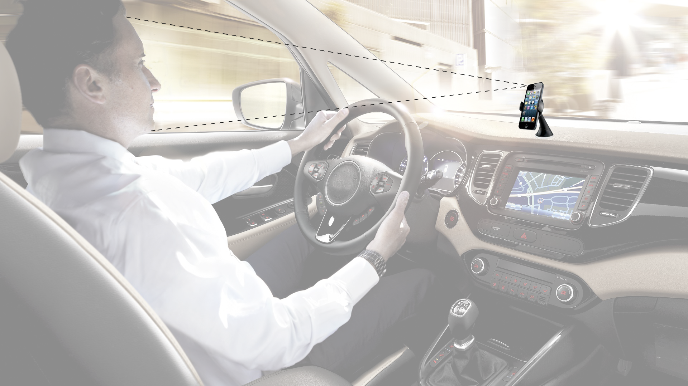

# Awake monitor _vision_
Vision how to prevent driver to fall asleep via heart rate monitoring based on my previous [bpm project](http://github.com/michalsindelar/bpm), which detects heart rate from short video of face via using photopletysmography. See theory behind directly in [project's documentation](http://github.com/michalsindelar/bpm).

## Mobile phone
Assume situation in car when driver puts phone into car mount and adjust view of front camera to his face. After that application shall be started. At first camera should calibrate itself and detect driver's normal heart rate, or driver can set on his own. Note that this is needed only before first use.

## How to detect falling asleep
Heart rate of human while falling asleep decreases under normal rate. This application can detect this falling heart rate. After double checking of correct results application starts playing some loud sounds until driver pushes confirmation button. After this driver should definitely take a rest, but it's obvious.

## Limitation
This concept is applicable only in daylight, during night additional light to keep driver's face bright enough for front camera would be needed. Also mobile front has to produce good quality output. (+ Additional stabilization algorithms may be needed.)

## Samples

